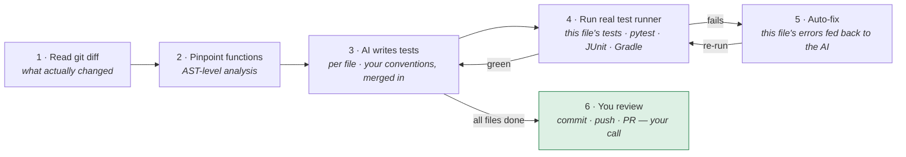

# test-automator

Generate unit tests for changed functions on your **local machine**, using **Claude Code** (or Copilot/Gemini CLI) instead of a pay-per-token API.

Supported languages: **Python** (pytest), **Kotlin** (JUnit 5 + MockK + Strikt), **Java** (JUnit + Mockito), and **JavaScript/TypeScript** (Jest, with Vitest and Create React App auto-detected) — including **React** components and hooks, tested with React Testing Library.

Same pipeline as the GitHub Actions version, but it runs from your terminal, reads `git diff` instead of a GitHub PR, and uses your Claude Code subscription instead of pay-per-API-call. After tests are generated and pass, it can optionally commit them, push the branch, and open a PR via `gh`.

## When to use this vs. the GitHub Action version

| | Local version | Action version |
|---|---|---|
| Trigger | You run a command | PR opened/updated |
| LLM | Claude Code (subscription) | Anthropic API (pay per use) |
| Cost per run | $0 (covered by subscription) | ~$0.05-$0.20 |
| Enforcement | Voluntary — devs opt in | Automatic on every PR |
| Setup per project | Just install the CLI | Add a workflow file |
| Best for | Personal use, small teams already on Claude Code | Teams that want enforced coverage |

## Prerequisites

1. **Python 3.10+**
2. **git** (you almost certainly have this)
3. **Claude Code** — Anthropic's CLI. Install:
   ```bash
   npm install -g @anthropic-ai/claude-code
   ```
   Then run `claude` once and complete the sign-in flow. Verify with:
   ```bash
   claude --version
   ```
4. **gh CLI** *(only if you want auto-PR-opening)*. Install from https://cli.github.com/ and run `gh auth login`.

## Install

```bash
git clone https://github.com/gautam-calfus/test-automator.git
cd test-automator
pip install -e .
```

Or install a tagged release directly:
```bash
pip install "git+https://github.com/gautam-calfus/test-automator.git@v0.1"
```

Verify:
```bash
test-automator --help
```

## Quick start

In any supported project that has changes since `main` — committed, uncommitted, or untracked:

```bash
cd your-project/
test-automator --base-branch main --source-root src
```

This:
1. Diffs your **working tree** against the merge-base with `main` (so uncommitted and untracked changes count; pass `--committed-only` to diff committed changes only) and finds changed source files
2. Parses each file (tree-sitter/AST) to find affected functions — and functions **removed** since the merge-base, whose stale tests are pruned automatically
3. Reads any existing test files for those sources
4. Asks the LLM CLI to generate or update tests
5. Runs the language's real test runner (pytest / Gradle / Jest) against them
6. If anything fails, asks the LLM to fix it (configurable retries)
7. Prints a summary

Tests are written to the configured test dir but **not committed** by default. You inspect them, decide what to keep, edit if needed, then commit yourself.

### Python projects (pip or uv)

By default (`--python-runner auto`) the runner detects how your project
is managed and invokes pytest accordingly:

- **uv-managed projects** — a `uv.lock`, or a `[tool.uv]` table in
  `pyproject.toml` — run through **`uv run python -m pytest`**, so tests
  execute against the exact dependencies in your lockfile. `uv run`
  resolves/syncs the environment for you; you don't have to activate a
  venv first.
- **Everything else** (pip + venv, Poetry, etc.) runs through plain
  **`python -m pytest`** using whatever interpreter is on `PATH`
  (activate your venv first, as before).

Override the choice with `--python-runner`:

```bash
test-automator --base-branch main --source-root src --python-runner uv
```

- `auto` (default): `uv run` when uv-managed **and** the `uv` binary is
  installed; otherwise plain `python -m pytest`.
- `uv`: always `uv run` (fails with a clear "command not found" if uv
  isn't installed — that's the point of forcing it).
- `pip`: always plain `python -m pytest`.

The tool never installs packages — pytest and your project's deps must
already be resolvable (`uv sync` / `pip install`) in the target project.

### Node.js (JavaScript/TypeScript) projects

Works the same way — `.js`, `.jsx`, `.ts`, `.tsx`, `.mjs`, and `.cjs` files are picked up automatically:

```bash
cd your-node-project/
test-automator --base-branch main --source-root src
```

Notes specific to Node projects:
- The project's dependencies must be installed (`npm install`) and Jest or
  Vitest must be among them — the runner invokes `npx --no-install jest`
  (or `vitest run`) and never installs packages itself.
- The framework is auto-detected from `package.json` (the `scripts.test`
  command wins, then the dependency lists; Jest is the default).
- New test files are colocated with the source (`src/utils/format.ts` →
  `src/utils/format.test.ts`). Existing tests at other conventional spots
  (`*.spec.*`, `__tests__/`, a `tests/` mirror) are found and extended
  instead of duplicated.
- Generated tests mirror the source file's module system (`require` vs
  `import`) so they load under the project's existing Jest/TS config.
- **React** components and hooks (`.jsx`/`.tsx`, or JSX/hook APIs in
  plain `.js`/`.ts`) get React Testing Library tests — `render`,
  `screen`, `fireEvent`, and `renderHook` for custom hooks, asserting
  on rendered output rather than implementation details. Create React
  App projects are detected from `package.json` and run through
  `react-scripts test --watchAll=false` (bare `jest` can't see CRA's
  embedded config). The project needs `@testing-library/react` and a
  jsdom test environment installed — standard in CRA/Next/Vite React
  templates.

## How it works



Steps 3–5 run **per file**: each file's tests are generated, run, and fixed before the next file is touched — so a failure is caught immediately and attributed to the file that caused it, and the fixer only spends calls on files that actually fail. A final combined run over all files is the commit gate.

The fix loop is bounded and honest: environment problems (missing dependencies, JDK/Gradle version mismatches, build-cache locks) are detected and reported with actionable messages instead of being "fixed" blindly — the loop only engages for failures the AI can address by rewriting test code.

## Generate, commit, push, and open a PR in one command

```bash
test-automator \
  --base-branch main \
  --source-root src \
  --open-pr
```

`--open-pr` implies `--push` which implies `--commit-tests`. So:

1. Tests generated and run as above
2. Tests committed with author `test-automator[bot]`
3. Commit pushed to your current branch's remote
4. PR opened via `gh pr create`

The commit message includes the pytest results, so reviewers see pass/fail counts and any failed test IDs without leaving the GitHub UI.

## CLI options

| Flag | Default | What it does |
|---|---|---|
| `--repo-path` | (auto-detect) | Path to your repo root |
| `--base-branch` | `main` | Branch to diff against. A remote ref (`origin/develop`) is auto-fetched first so the diff reflects the live remote |
| `--no-fetch` | off | Skip the auto-fetch for a remote `--base-branch` (offline/deterministic) |
| `--committed-only` | off | Diff committed changes only (`base...HEAD`) instead of the working tree |
| `--repair-existing` | off | If the existing test suite doesn't compile, try to LLM-fix the broken existing test files before generating |
| `--test-dirs` | `tests` | Comma-separated test dirs (priority order) |
| `--source-root` | (none) | Restrict analysis to files under this path |
| `--max-fix-retries` | `3` | How many times to ask the LLM to fix failing tests |
| `--commit-tests` | off | Commit the generated tests |
| `--push` | off | Push the commit; implies `--commit-tests` |
| `--open-pr` | off | Open PR via `gh`; implies `--push` |
| `--llm` | `claude` | LLM CLI backend: `claude`, `copilot`, `gemini`, or `custom` |
| `--llm-cmd` | (provider default) | Override the CLI binary; for `custom`, the full command to run |
| `--claude-code-cmd` | `claude` | Override if your Claude Code binary is named differently |
| `--claude-code-timeout` / `--llm-timeout` | `180` | Seconds to wait for each LLM CLI response |
| `--max-output-tokens` | `16000` | Output-token cap per Claude Code call — the main quota lever (`CLAUDE_CODE_MAX_OUTPUT_TOKENS`) |
| `--java-file-filter` | (all) | Java: only generate for `services`, `controllers`, `daos`, `handlers` |
| `--file` | (all changed) | Only process the named file(s). Repeat the flag or pass a comma-separated list (`--file a,b`) |
| `--python-runner` | `auto` | How to run pytest: `auto` (uv when the project is uv-managed and `uv` is installed, else plain), `uv`, or `pip` |
| `--regenerate-passing` | off | Force regeneration of files that are already up to date (bypass the idempotency check below) |

## Re-running is idempotent

Running the tool twice on the same code will **not** re-invoke the LLM or
rewrite tests that are already correct. When a file's tests are generated
and pass, the tool embeds a small **coverage manifest** at the top of the
test file recording a hash of each covered function's source:

```java
// test-automator:begin — generated coverage manifest, do not edit
// com.acme.AdminService.createNewUsers 5f2c9a1b3d4e6f70
// test-automator:end
```

On a later run, a changed function is regenerated only if its current
source hash differs from the recorded one. If nothing changed, the file
is skipped entirely — **no LLM call, no diff** — even if the tests are
named for behavior (`shouldInsertUserWhen…`) rather than the method. The
manifest is committed with the test, so this holds across machines and in
CI, not just on the laptop that first generated it. Change a function and
only *that* function's tests regenerate; the manifest updates itself.

Use `--regenerate-passing` to force a rewrite anyway.

## Choosing an LLM backend

Test generation works with any of these CLIs — pick with `--llm`:

```bash
# Claude Code (default; uses your Anthropic subscription)
test-automator --base-branch main --source-root src

# GitHub Copilot CLI (npm install -g @github/copilot; GitHub auth + Copilot subscription)
test-automator --llm copilot --base-branch main --source-root src

# Gemini CLI (npm install -g @google/gemini-cli; Google login or GEMINI_API_KEY)
test-automator --llm gemini --base-branch main --source-root src

# Anything else that takes a prompt as its last argument and prints to stdout
test-automator --llm custom --llm-cmd "mycli --model foo" --base-branch main --source-root src
```

Notes:

- All languages (Python, Kotlin, Java) work with every backend — prompts
  and response parsing are language-side, not model-side.
- Claude Code gets the most controlled invocation (true system prompt,
  tools disabled, output-token cap raised). Copilot and Gemini run in
  their programmatic/headless modes (`-p`) with the style guide folded
  into the prompt; no tool permissions are granted, so they answer in
  text only.
- Test QUALITY varies by model. The prompts encode strict conventions,
  and the extractors tolerate markdown fences and prose from any model,
  but the fix loop may need more retries on weaker models.

## How it integrates with your editor

This tool runs in your terminal. It works alongside whatever editor you use because it operates on git state, not editor state. Suggested workflows:

**VS Code / Cursor**: open the integrated terminal (Ctrl+`), run the command. Tests appear in your project's test directory; VS Code's file watcher picks them up.

**JetBrains (IntelliJ / PyCharm)**: same — built-in terminal.

**Neovim/Vim**: run from your usual terminal, the editor picks up changes when you refocus.

**As a git hook (advanced)**: drop a wrapper into `.git/hooks/pre-push` that calls this tool. Tests get generated automatically before each push. Worth doing only after you've verified the tool's output style matches your team's expectations.

## What it does NOT do

- Modify your source code (only writes to test files)
- Send anything to Anthropic's API (Claude Code uses your subscription)
- Run if you have no uncommitted/committed changes since the base branch
- Enforce a coverage threshold (use `pytest-cov` with `--cov-fail-under` for that)
- Work for languages other than Python, Kotlin, Java, and JavaScript/TypeScript (other languages plug in via the `LanguageHandler` protocol — see `src/test_automator/languages/`)

## Cost

Per run: **$0** beyond your Claude Code subscription. Claude Code's pricing structure is per-user-per-month, not per-API-call, so even hundreds of runs/day cost the same.

By contrast, the GitHub Actions version costs ~$0.05-$0.20 per PR via the pay-per-token API.

## Limitations to know about

1. **One-shot Claude Code invocations.** This tool calls `claude --print` for each generation, which is a one-shot non-conversational mode. Claude Code's more powerful conversational features (multi-turn, file editing in place) aren't used here.

2. **No `tests/conftest.py` discovery.** Claude doesn't see your fixtures. If your existing tests rely heavily on conftest, Claude's generated tests may try to redefine fixtures inline. Worth checking and editing.

3. **The `covers()` heuristic is imperfect.** If you have a source function `bulk` and another `bulk_discount`, tests covering `bulk_discount` (e.g., `test_bulk_discount_zero`) might be wrongly matched to `bulk`. Pragmatic mitigation: name your functions distinctively.

4. **No class-based test support.** Free-floating `def test_*` only. If your team uses `class TestFoo:` style, the merge logic doesn't handle the class context cleanly.

5. **No Windows testing.** Should work in WSL or Git Bash, untested elsewhere.

## Troubleshooting

### `claude: command not found`
Claude Code isn't installed or isn't on PATH. Install with `npm install -g @anthropic-ai/claude-code` and run `claude` once to authenticate.

### `Base branch 'main' not found`
The base branch needs to exist locally. Try:
```bash
git fetch origin main:main
```

### Tests fail with `ModuleNotFoundError: No module named 'mypackage'`
Your project needs to be pip-installed so generated tests can import your code:
```bash
pip install -e .
```

### `gh pr create failed`
Either `gh` isn't installed, you're not authenticated (`gh auth login`), or a PR already exists for this branch (in which case the tool will reuse it on the next run).

### Tests are weird/wrong/duplicated
- Read them before committing — Claude has good days and bad days
- If existing tests get clobbered, file an issue with the test file content before/after

## Programmatic use

If you want to call this from your own Python code instead of via CLI:

```python
from test_automator import LocalTestConfig, LocalTestPipeline

config = LocalTestConfig(
    repo_path="/path/to/your/repo",
    base_branch="main",
    source_root="src",
    commit_tests=True,
    push=True,
)
result = LocalTestPipeline(config).run()
print(result.is_passing, result.tests_generated)
```

## Swapping the LLM

The `llm_bridge.py` module exposes an `LLMBridge` protocol. The default is `ClaudeCodeBridge`, but you can implement any backend. For example, to use a local Ollama model:

```python
import subprocess

class OllamaBridge:
    def generate(self, system_prompt: str, user_prompt: str) -> str:
        combined = f"{system_prompt}\n\n{user_prompt}"
        proc = subprocess.run(
            ["ollama", "run", "qwen2.5-coder:7b", combined],
            capture_output=True, text=True, check=True,
        )
        return proc.stdout

pipeline = LocalTestPipeline(config, llm=OllamaBridge())
```

Quality drops with smaller models, but cost goes to literally zero.

## License

MIT
